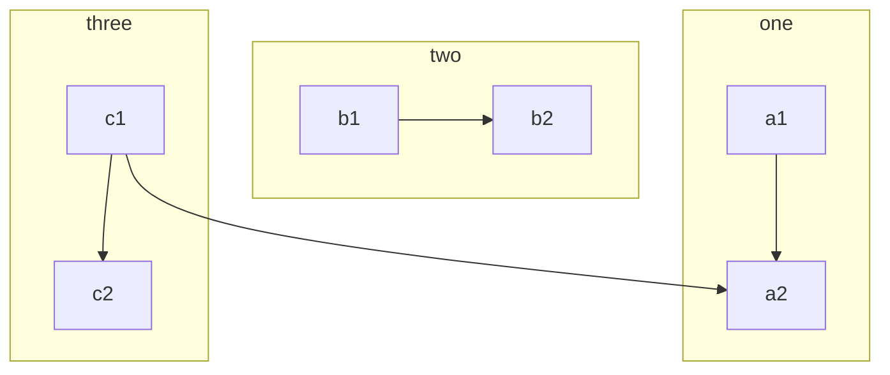
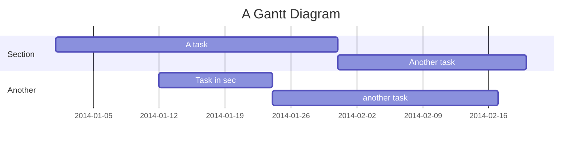
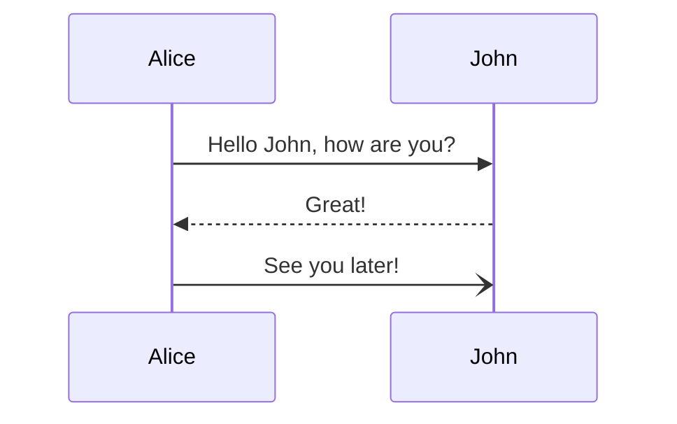
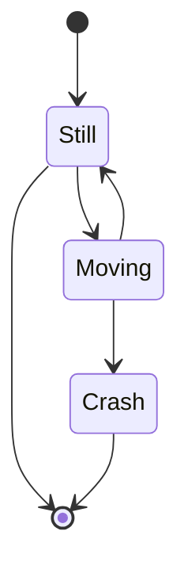
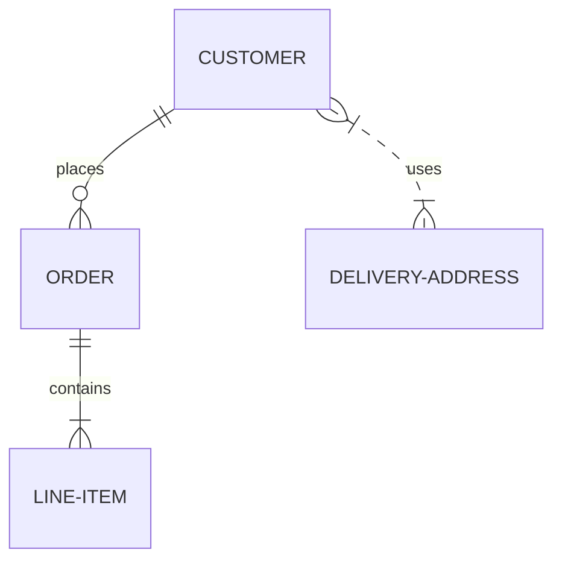
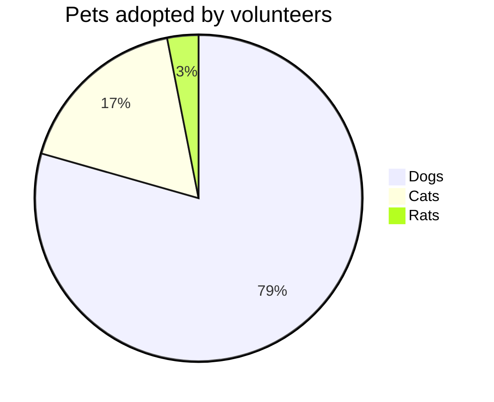

# Welcome to the editor

You can use the Redocly editor to customize your developer portal by
adding Markdown documents and updating the side navigation. You can
also update styles by adding a `styles.css` file and reuse content by
adding partial Markdown files.

This welcome document will guide you through what you can
alter in the Markdown documents.

Check out the [Config file](https://newportal-docs.redoc.dev/config/) documentation for more
information about the `redocly.yaml` file for even more ways you can customize your developer
portal including adding the following:

* RBAC configurations
* redirects
* custom themes
* API catalog
* search
* scripts, links, and SEO
* and more

<!-- If you are a TypeScript developer or React component creator, check out
the [Custom Theme](https://newportal-docs.redoc.dev/build-themes/build-custom-theme/) documentation. -->

## Add Markdown documents

Adding Markdown documents means you can write use cases, step-by-step tutorials,
or conceptual content that you can then include with your API reference pages.
We have also integrated Markdoc and Mermaid, which provide
you additional formatting options for your Markdown.

### Markdoc components

Our portal uses [Markdoc tags](https://markdoc.dev/docs/tags) to add custom components to the [CommonMark](https://commonmark.org/) Markdown specification.

These tags extend the limited formatting ability of standard Markdown content.

We have added the following tags:

* [admonitions](#admonitions)
* [details (progressive disclosures)](#details)
* [HTML blocks](#html-blocks)
* [tabs](#tabs)
* [typography](#typography)

Our integration with Markdoc also means you can add your own custom tags.
<!-- See our [Add custom tags](https://newportal-docs.redoc.dev/build-themes/custom-markdoc-tags/) documentation for more information. -->

#### Admonitions

Admonitions are helpful for calling your users' attention to
a specific piece of information as a warning, informational note, or
an indication of success. The following are examples of how you could
use the admonitions we have provided; however, they can be customized by changing the
names or even the background color in your styles document.


This is a **Warning** message



This is a **Success** message



This is an **Attention** message



This is a **Danger** message


#### Details

A progressive disclosure allows a reader to select text that may not
be necessary, but adds helpful context. For instance, if you want to provide
background information or conceptual information that doesn't directly
explain how to do something in a step-by-step guide.


This is more information about a subject that may not directly aid a user
in completing a set of instructions, but could be helpful for those
who are interested in learning more.


#### HTML blocks

Sometimes when you are writing in Markdown, you need to add
an HTML element that is not easily included, for instance a
video. This component allows you to add HTML elements to your Markdown.

<iframe width="560"
height="315"
src="https://www.youtube.com/embed/NcEHOlnAY6A"
frameborder="0"
allow="accelerometer; autoplay; encrypted-media; gyroscope; picture-in-picture" allowfullscreen></iframe>

<div class="np">Some Text that summarizes the video content above.</div>


#### Typography

Sometimes you may want to alter the color, style, or size of text
on a given page of Markdown, without updating your CSS styles.

This Markdoc component allows you to update your text in the Markdown.

I don't want all of my text to be red just this text.

You can also alter heading text, as in the following example:

## Glorious heading 

You can also alter numbers, as in the following example:

15

<!-- For more information on the attributes you can include,
see [Typography](https://newportal-docs.redoc.dev/content/markdoc-components/typography/)
in our documentation. -->

#### Tabs

Tabs are useful for offering readers different options in code blocks
or even in regular content. You can even next tabs.

The following example includes a code block tab nested within a content tab that includes a numbered list:





  Create a widget by making the following HTTP request to the API:

  
  ```curl
    curl -i -X POST http://{HOSTNAME}:8000/widgets
  ```
  ```HTTPie
    http -f :8000/widgets
  ```
  





Create a widget by completing the following steps in the UI:
  1. Select the profile.
  2. Select **Widgets**.
  3. Select **New Widget**.
  4. Select **Create**.




### Mermaid

You can also create [Mermaid diagrams](https://mermaid.js.org/)
and embed them into your Markdown.


For all of the following diagram examples, titles are not supported.


We currently support the following diagram types:

#### Flowchart

See the Mermaid.js [Flowchart](https://mermaid.js.org/syntax/flowchart.html) documentation for more information.



#### Gantt chart

See the Mermaid.js [Gantt](https://mermaid.js.org/syntax/gantt.html) documentation for more information.


#### Sequence diagram

See the Mermaid.js [Sequence diagram](https://mermaid.js.org/syntax/sequenceDiagram.html) documentation for more information.



#### State diagram

See the Mermaid.js [State diagram](https://mermaid.js.org/syntax/stateDiagram.html) documentation for more information.



#### Entity Relationship diagram

See the Mermaid.js [Entity Relationships diagrams](https://mermaid.js.org/syntax/entityRelationshipDiagram.html) documentation for more information.



#### Pie chart

See the Mermaid.js [Pie chart](https://mermaid.js.org/syntax/pie.html) documentation for more information.



## Styles

The Redocly developer portal uses CSS variables for styling the look and feel
of the portal. So, you can customize many of the styles used in the developer
portal by updating the value of the CSS variable.

To update the CSS variable's value:

1. Add a `@theme` folder to your project if you do not already have one.
2. Add a `styles.css` file to the new `@theme` folder if you do not already have one.
3. Determine the variable for what you want to update, using your browser's developer
   tools to inspect the element. Or find the item in the CSS variables dictionary in the documentation.
4. Add the variable to your `styles.css` file with the updated value.

As an example, you can change the color of the top navigation pane to green by
adding the following CSS to your `styles.css` file:

```css
:root {
    --navbar-background-color: green;
}
```

<!-- For more information see [CSS variables dictionary](https://newportal-docs.redoc.dev/content/styles-css-variables/) in the documentation. -->

## Side navigation

The Redocly developer portal automatically creates a list of side navigation links based
on the files and folders you have in your project. However, creating a `sidebars.yaml`
file allows you to customize the side navigation in the following ways:

* exclude certain files or folders
* control the order of the files and folders
* create multiple side navigation menus

If a `sidebars.yaml` file is in your project, your side navigation will only display what
is listed in it. If you place a `sidebars.yaml` file
within a folder in your project, you can create multiple side navigation menus.

For example, the following example `sidebars.yaml` file placed in the root of your project
will display only the `markdoc.md` file, even if you have other files in the root of your project:

```yaml
- page: markdoc.md
  label: Welcome
```

You will also notice the `label` underneath the page's location in the project, which determines
the title that is listed in the side navigation. If you do not include a label, the Markdown page's
first heading will be used instead.

To create multiple side navigation menus:

1. If you haven't already, add a `sidebars.yaml` file to the root of your project.
2. Create a folder and add some Markdown pages and a `sidebars.yaml` file to it.
3. List the Markdown pages in the folder in the `sidebars.yaml` file.
4. Add a link to one of the Markdown pages in the folder to a page listed in the root `sidebars.yaml` file.
5. Click the link to go to the page and change the side navigation to the one in the folder.

## Content reuse

If you need to use the same exact content in multiple places in your documentation, best practice
is to write the content in a single file and insert it programmatically, instead of copying and pasting
the content manually. Otherwise, it can be very difficult to keep all the places the content exists consistently accurate.

You can add partial files to your project and reference them in Markdown files using the partial component.
Partial files can be located in `_partials` folder in your project.


Partial file names must begin with an underscore (_).


The following example inserts content from the `partial-file.md` located in the `_partials` folder.

```markdoc 

```

You can also insert variables into partials, depending on the page that references them.
See Mardoc's [Partials](https://markdoc.dev/docs/partials) documentation for more information.

## Running the portal locally

Run the project locally to test content updates before pushing them up for others to view.

### Prerequisites

- [node.js >= 16.17.1](https://nodejs.org/en/)

### Install

```
npm install
```

### Start development server

```
npx @redocly/portal develop
```

### Build portal

```
npm build
```
